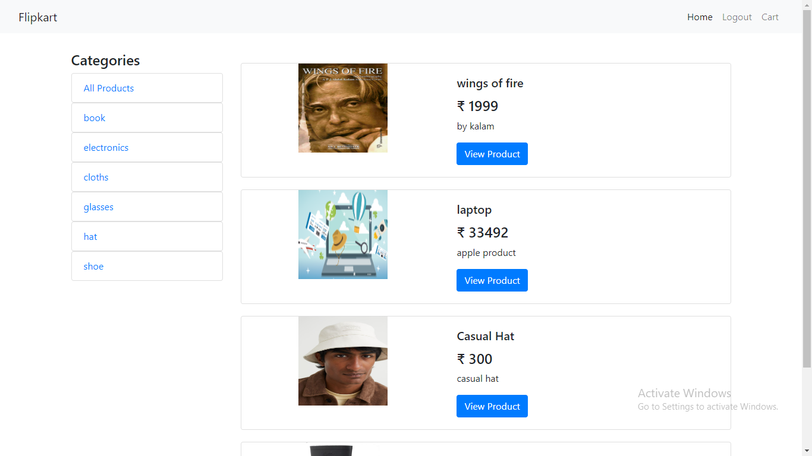
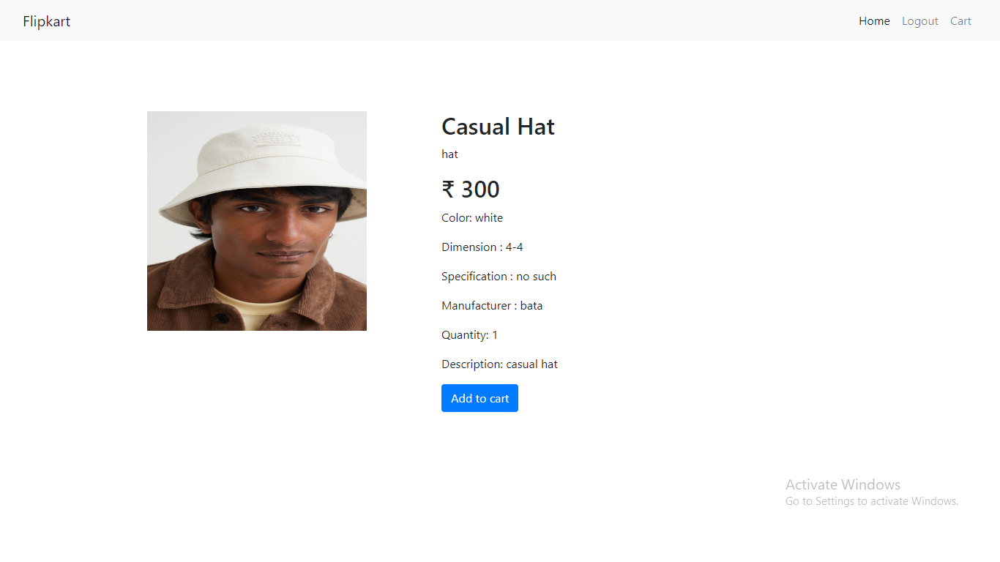
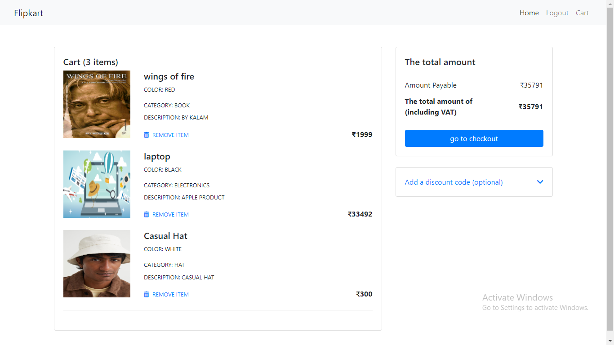
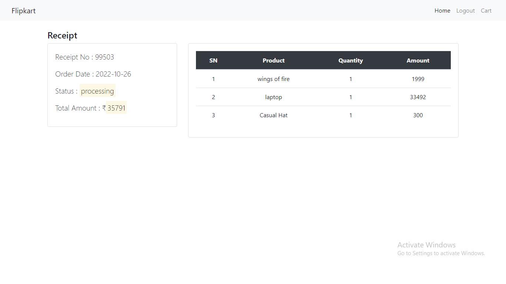

# Online Shopping App

- This app performs all the fundamental CRUD operations of any Online Shopping Management System platform with user validation at every step.
- This project is fully developed by me.

## Tech Stack

- Java
- Spring Framework
- Spring Boot
- Spring Data JPA
- Spring Security
- Thymeleaf
- Hibernate
- MySQL
- PostMan
- Lombok

## Modules

- Login, Logout Module
- User Module
- Admin Module
- Category Management Module
- Product Management Module
- Feedback Module
- Cart Module

## Features

- User and Admin authentication & validation with spring security is done.
- Admin Features:

  - Administrator Role of the entire application
  - Only registered admins with valid session can add/update/delete category, product from main database.

- User Features:
  - A user can register himself or herself on the platform.
  - He/She can check the all products and can check products by category.
  - He/She can view the product's all details.
  - User can add products to their cart.
  - Can remove products from their cart or can checkout and pay.
  - When paid they will recieve a receipt with all details of that order.

## Installation & Run

- Before running the server, you should update the database config inside the [application.properties](https://github.com/mrFarooque/OnlineShopping/blob/main/OnlineShopping/src/main/resources/application.properties) file.
- Update the port number, username and password as per your local database config.

```
    server.port=8888

    spring.datasource.url=jdbc:mysql://localhost:3306/db2;
    spring.datasource.driver-class-name=com.mysql.cj.jdbc.Driver
    spring.datasource.username=root
    spring.datasource.password=farsql

```

## API Root Endpoint

`https://localhost:8080/`

`http://localhost:8080/admin/home`

`http://localhost:8080/user/shop`

## Video Explainer of flow control

<a href="#">**Video Drive Link** </a>

### E-R Diagram Of Online Shopping Application

---


---

### Home Page

---


---

### Registration Page

---


---

### Login Page

---


---

### Admin Home

---


---

### Product Management Page

---


---

### User Home

---



---

### Product Details

---



---

### Cart Page

---



---

### Receipt Page

---



---


---
